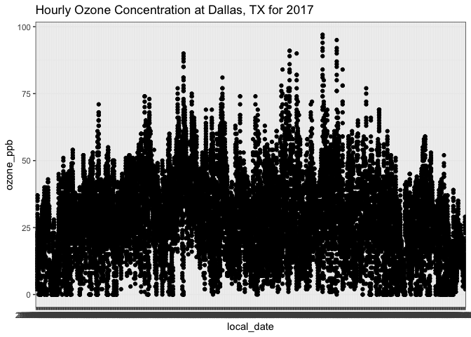
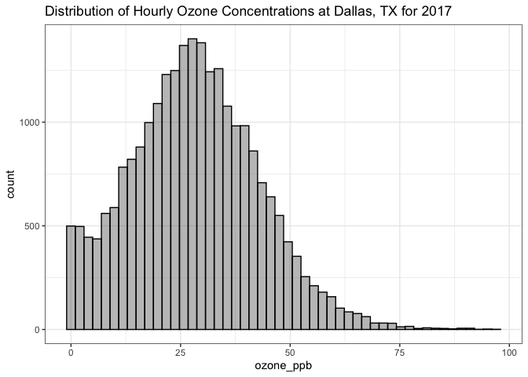
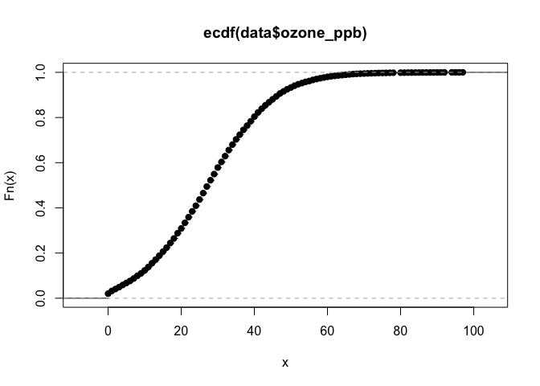
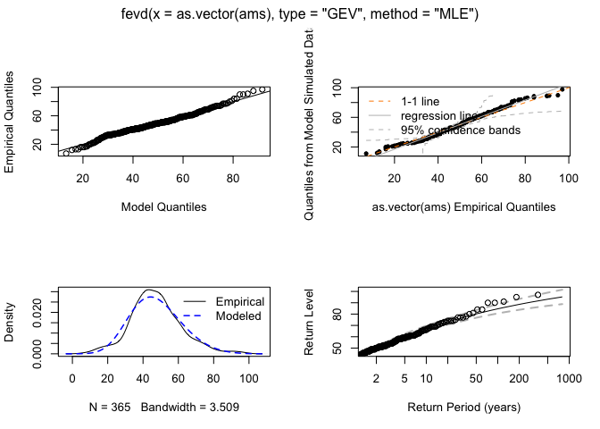
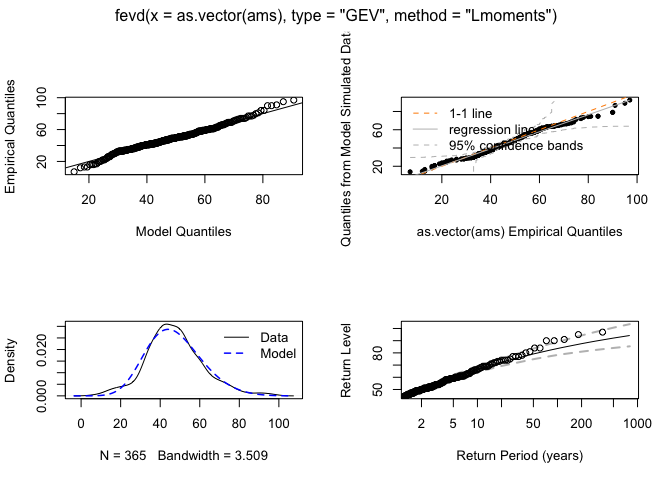
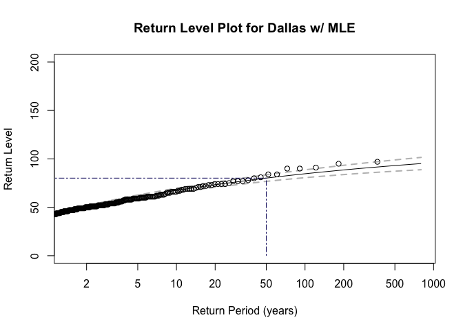

Ozone Risk Analysis
================
Daniel Phoenix

    ## 
    ## Attaching package: 'dplyr'

    ## The following objects are masked from 'package:stats':
    ## 
    ##     filter, lag

    ## The following objects are masked from 'package:base':
    ## 
    ##     intersect, setdiff, setequal, union

    ## Loading required package: coda

    ## Loading required package: MASS

    ## 
    ## Attaching package: 'MASS'

    ## The following object is masked from 'package:dplyr':
    ## 
    ##     select

    ## ##
    ## ## Markov Chain Monte Carlo Package (MCMCpack)

    ## ## Copyright (C) 2003-2021 Andrew D. Martin, Kevin M. Quinn, and Jong Hee Park

    ## ##
    ## ## Support provided by the U.S. National Science Foundation

    ## ## (Grants SES-0350646 and SES-0350613)
    ## ##

    ## Loading required package: Matrix

    ## Loading required package: lme4

    ## 
    ## arm (Version 1.11-2, built: 2020-7-27)

    ## Working directory is /Users/danielphoenix/Documents/GitHub/stats_excercises

    ## 
    ## Attaching package: 'arm'

    ## The following object is masked from 'package:coda':
    ## 
    ##     traceplot

    ## Loading required package: Lmoments

    ## Loading required package: distillery

    ## 
    ## Attaching package: 'extRemes'

    ## The following object is masked from 'package:MCMCpack':
    ## 
    ##     BayesFactor

    ## The following objects are masked from 'package:stats':
    ## 
    ##     qqnorm, qqplot

    ## Loading required package: zoo

    ## 
    ## Attaching package: 'zoo'

    ## The following objects are masked from 'package:base':
    ## 
    ##     as.Date, as.Date.numeric

    ## 
    ## Attaching package: 'xts'

    ## The following objects are masked from 'package:dplyr':
    ## 
    ##     first, last

Read in the yearly CSV files of Ozone for Dallas, TX (row 14 is ozone)

``` r
data <- read.csv("~/Documents/GitHub/hurricanes_dfw_airQuality/data/o3_data/dallas_2017.csv")[,10:14]
names(data) <- c("local_date","local_hour","utc_date","utc_hour","ozone_ppm")
data <- data %>% mutate(ozone_ppb = ozone_ppm*1.0E3)
head(data,30)
```

    ##    local_date local_hour   utc_date utc_hour ozone_ppm ozone_ppb
    ## 1  2017-01-01      01:00 2017-01-01    07:00     0.010        10
    ## 2  2017-01-01      02:00 2017-01-01    08:00     0.003         3
    ## 3  2017-01-01      03:00 2017-01-01    09:00     0.004         4
    ## 4  2017-01-01      04:00 2017-01-01    10:00     0.003         3
    ## 5  2017-01-01      05:00 2017-01-01    11:00     0.007         7
    ## 6  2017-01-01      06:00 2017-01-01    12:00     0.004         4
    ## 7  2017-01-01      07:00 2017-01-01    13:00     0.002         2
    ## 8  2017-01-01      08:00 2017-01-01    14:00     0.002         2
    ## 9  2017-01-01      09:00 2017-01-01    15:00     0.004         4
    ## 10 2017-01-01      10:00 2017-01-01    16:00     0.006         6
    ## 11 2017-01-01      11:00 2017-01-01    17:00     0.008         8
    ## 12 2017-01-01      12:00 2017-01-01    18:00     0.010        10
    ## 13 2017-01-01      13:00 2017-01-01    19:00     0.016        16
    ## 14 2017-01-01      14:00 2017-01-01    20:00     0.019        19
    ## 15 2017-01-01      15:00 2017-01-01    21:00     0.024        24
    ## 16 2017-01-01      16:00 2017-01-01    22:00     0.022        22
    ## 17 2017-01-01      17:00 2017-01-01    23:00     0.013        13
    ## 18 2017-01-01      18:00 2017-01-02    00:00     0.010        10
    ## 19 2017-01-01      19:00 2017-01-02    01:00     0.016        16
    ## 20 2017-01-01      20:00 2017-01-02    02:00     0.011        11
    ## 21 2017-01-01      21:00 2017-01-02    03:00     0.018        18
    ## 22 2017-01-01      22:00 2017-01-02    04:00     0.020        20
    ## 23 2017-01-01      23:00 2017-01-02    05:00     0.017        17
    ## 24 2017-01-02      00:00 2017-01-02    06:00     0.017        17
    ## 25 2017-01-02      01:00 2017-01-02    07:00     0.017        17
    ## 26 2017-01-02      02:00 2017-01-02    08:00     0.016        16
    ## 27 2017-01-02      03:00 2017-01-02    09:00     0.015        15
    ## 28 2017-01-02      04:00 2017-01-02    10:00     0.017        17
    ## 29 2017-01-02      05:00 2017-01-02    11:00     0.022        22
    ## 30 2017-01-02      06:00 2017-01-02    12:00     0.027        27

Plot Ozone timeseries

``` r
ggplot(data, aes(x=local_date, y=ozone_ppb)) + geom_point() + ggtitle("Hourly Ozone Concentration at Dallas, TX for 2017") + theme_bw()
```

<!-- -->

Plot PDF of Ozone concentrations

``` r
ggplot(data, aes(ozone_ppb)) + geom_histogram(bins=50,alpha=0.4,color='black') + ggtitle("Distribution of Hourly Ozone Concentrations at Dallas, TX for 2017") + theme_bw()
```

<!-- -->

Cumulative distribution for ozone concentration

``` r
plot(ecdf(data$ozone_ppb))
```

<!-- -->

``` r
cdf_ozone <- ecdf(data$ozone_ppb)
```

Calculate return period

``` r
ozone_thres <- 80
prob_exceed <- (1-cdf_ozone(ozone_thres))
#tau_ozone <- e_l / prob_exceed

print(prob_exceed)*100
```

    ## [1] 0.001544464

    ## [1] 0.1544464

Need to derive return period –&gt; use bayesian framework w/ MCMC
algorithm

This approach for modeling extremes of a time-series of observations is
based on the utilization of maximum or minimum values of these
observations within a certain sequence of constant length. For a
sufficiently large number n of established blocks, the resulting peak
values of these n blocks of equal length can be used for fitting a
suitable distribution of these data. While the block size is basically
freely selectable, a trade-off has to be made between bias (small
blocks) and variance (large blocks). Usually, the length of the
sequences is often chosen to correspond to a certain familiar time
period, in most cases a year (we’ll do daily max ozone here). The
resulting vector of annual maxima is called “Annual Maxima Series” or
AMS.

According to the Fisher–Tippett–Gnedenko theorem, the distribution of
block maxima can be approximated by a generalized extreme value
distribution.

``` r
data$local_date <- as.Date(data$local_date)
ozone_ts <- xts(data$ozone_ppb, data$local_date)
ams <- apply.daily(ozone_ts, max)

# Derive AMS for maximum ozone
fit_mle <- fevd(as.vector(ams), method="MLE", type="GEV")
plot(fit_mle)
```

<!-- -->

Print the return levels

``` r
rl_mle <- return.level(fit_mle, conf = 0.05, return.period= c(2,5,10,20,50,100))
rl_mle
```

    ## fevd(x = as.vector(ams), type = "GEV", method = "MLE")
    ## get(paste("return.level.fevd.", newcl, sep = ""))(x = x, return.period = return.period, 
    ##     conf = 0.05)
    ## 
    ##  GEV model fitted to  as.vector(ams)  
    ## Data are assumed to be  stationary 
    ## [1] "Return Levels for period units in years"
    ##   2-year level   5-year level  10-year level  20-year level  50-year level 
    ##       46.52408       59.64294       66.99253       73.18487       80.11709 
    ## 100-year level 
    ##       84.61416

Fitting of GEV distribution based on L-moments estimation

``` r
fit_lmom <- fevd(as.vector(ams), method="Lmoments", type="GEV")
plot(fit_lmom)
```

<!-- -->

``` r
rl_lmom <- return.level(fit_lmom, conf = 0.05, return.period= c(2,5,10,20,50,100))
rl_lmom
```

    ## fevd(x = as.vector(ams), type = "GEV", method = "Lmoments")
    ## get(paste("return.level.fevd.", newcl, sep = ""))(x = x, return.period = return.period, 
    ##     conf = 0.05)
    ## 
    ##  GEV model fitted to  as.vector(ams)  
    ## Data are assumed to be  stationary 
    ## [1] "Return Levels for period units in years"
    ##   2-year level   5-year level  10-year level  20-year level  50-year level 
    ##       46.33100       58.96896       66.12219       72.19708       79.05825 
    ## 100-year level 
    ##       83.54877

Return Level Plots

``` r
#par(mfcol=c(2,1))

# return level plot w/ MLE
plot(fit_mle, type="rl",
     main="Return Level Plot for Dallas w/ MLE",
     ylim=c(0,200), pch=16)
loc <- as.numeric(return.level(fit_mle, conf=0.05, return.period = 50))
segments(50, 0, 50, loc, col='midnightblue', lty=6)
segments(0.01, loc, 50, loc, col='midnightblue', lty=6)
```

<!-- -->

``` r
## return level plot w/ LMOM
#plot(fit_lmom, type='rl',
#     main="Return Level Plot for Dallas w/ L-Moments",
#     ylim=c(0,200))
#loc <- as.numeric(return.level(fit_lmom, conf=0.05, return.period=50))
#segments(50, 0, 50, loc, col= 'midnightblue',lty=6)
#segments(0.01,loc,50, loc, col='midnightblue', lty=6)
```

``` r
# comparison of return levels
results <- t(data.frame(mle=as.numeric(rl_mle),
                        lmom=as.numeric(rl_lmom)))
colnames(results) <- c(2,5,10,20,50,100)
round(results,1)
```

    ##         2    5   10   20   50  100
    ## mle  46.5 59.6 67.0 73.2 80.1 84.6
    ## lmom 46.3 59.0 66.1 72.2 79.1 83.5

In this case, both results are quite similar. In most cases, L-moments
estimation is more robust than maximum likelihood estimation. In
addition to these classical estimation methods, extRemes offers
Generalized Maximum Likelihood Estimation (GMLE, Martins and Stedinger,
2000) and Bayesian estimation methods (Gilleland and Katz, 2016).
Moreover, I have made the observation that maximum likelihood estimation
works more reliable in other R packages in some cases (e.g. fExtremes,
ismev).
